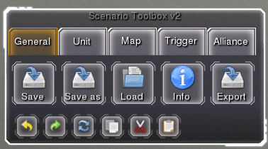

Starting out
============

The first thing we need to do before starting out is configure the environment in which we will run Scenario Editor.
An example on how to do it is given with SpringLobby, but it should be doable with most Spring lobbies.

First go to the *Singleplayer* tab and select a map and mod. In our example (Figure 1) we selected *Green Comet Basic* as the map, and *Scenario Editor BA* (Scenario Editor for Balanced Annihilation), version *0.2+* as the mod.
The following should be done:

1. Add at least two NullAIs participating in the game. Avoid adding *real* Skirmish AIs as they might hinder your editing.
2. Pick one of the Scenario Editor mods (mutators) configured for the game, and not the game itself. *Scenario Editor BA 0.2+* is correct, where *Balanced Annihilation v80* isn't.
3. Run it as a spectator by checking *Spectate only*.

.. figure:: mod_select.png
   :scale: 70%
   :align: center

   Figure 1. Scenario editor mod selection

In addition, depending on the game in question, you might need to select a specific end condition (*Options* tab). In the case of *Scenario Editor BA*, this is done by selecting *None* for the *Game End Mode* as shown on Figure 2.

.. figure:: mod_config.png
   :scale: 70%
   :align: center

   Figure 2. Scenario editor mod config

With this all configured you can start editing!

.. note:: Avoid running it in Multiplayer mode (even if it's just a host bot), as Scenario Editor might cause extensive network usage, and not work properly.

Toolbox
_______

Once you start the Scenario Editor you should see something similar to Figure 3.
In the top right part of the UI you should see the *Scenario Toolbox*, or just *Toolbox* for short. You will use this component to do complete most operations within the editor.

.. figure:: toolbox.jpg
   :align: center

   Figure 3. Initial screen

Zooming in (Figure 4), we look at the components of the Toolbox in detail.
Toolbox components are grouped in 5 categories that can be accessed in different tabs. Some of them also have :ref:`hot_keys`.

Along side that, common actions such as *Undo, Redo, Reload meta model, Copy, Cut and Paste* are accessible from all tabs. *Reload meta model* action is likely the only which usage isn't apparent, and will be described in the :ref:`meta_programming` section.

In the first tab, we can see access the components to do the following: Save, Save as, Load, Set project information and Export.

   Figure 4. General tab

The unit tab (Figure 5) is usually used to select and add units and features.

.. figure:: unit_tab.png
   :align: center

   Figure 5. Unit tab

The map tab (Figure 6) offers components for heightmap (terrain) and texturemap editing.

.. note:: Texture map saving is currently not implemented and is currently just experimental.

.. figure:: map_tab.png
   :align: center

   Figure 6. Map tab

The trigger tab (Figure 7) provides components to program the scenario, and can be used to add areas, triggers and variables. This will be explained in detail in the :ref:`gui_programming` section.

.. figure:: trigger_tab.png
   :align: center

   Figure 7. Trigger tab

The alliance tab (Figure 8) allows editing of players and alliances.

.. note:: Any changes to the Players component that leads to new teams being added or old ones removed requires a restart of the game.

.. figure:: alliance_tab.png
   :align: center

   Figure 8. Alliance tab
