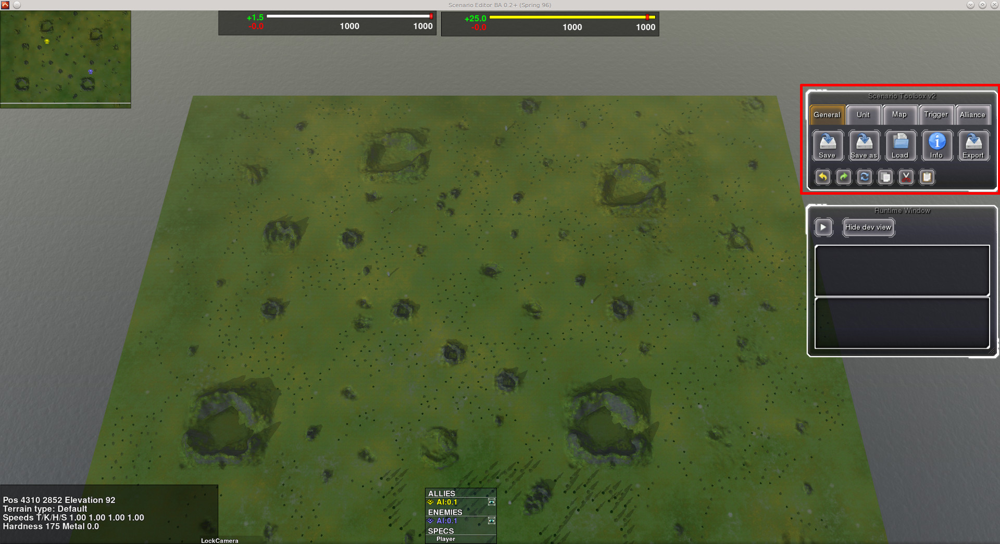
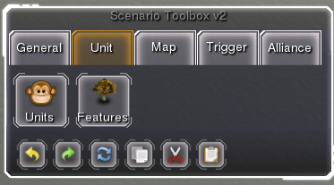
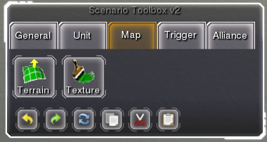
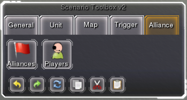

Starting out
============

First make sure you have properly installed SpringBoard.

.. TODO: install link/description

.. note:: Avoid running it in Multiplayer mode (even if it's just a host bot), as SpringBoard might cause extensive network usage, and not work properly.

Toolbox
_______

.. TODO: Redo everything with final version + new screens

Once you start the SpringBoard you should see something similar to Figure 3.
In the top right part of the UI you should see the *Scenario Toolbox*, or just *Toolbox* for short. You will use this component to do complete most operations within the editor.

   Figure 3. Initial screen

Zooming in (Figure 4), we look at the components of the Toolbox in detail.
Toolbox components are grouped in 5 categories that can be accessed in different tabs. Some of them also have :ref:`hot_keys`.

Along side that, common actions such as *Undo, Redo, Reload meta model, Copy, Cut and Paste* are accessible from all tabs. *Reload meta model* action is likely the only which usage isn't apparent, and will be described in the :ref:`meta_programming` section.

In the first tab, we can see access the components to do the following: Save, Save as, Load, Set project information and Export.

.. figure:: img/general_tab.png
   :align: center

   Figure 4. General tab

The unit tab (Figure 5) is usually used to select and add units and features.

   Figure 5. Unit tab

The map tab (Figure 6) offers components for heightmap (terrain) and texturemap editing.

.. note:: Texture map saving is currently not implemented and is currently just experimental.

   Figure 6. Map tab

The trigger tab (Figure 7) provides components to program the scenario, and can be used to add areas, triggers and variables. This will be explained in detail in the :ref:`gui_programming` section.

.. figure:: img/trigger_tab.png
   :align: center

   Figure 7. Trigger tab

The alliance tab (Figure 8) allows editing of players and alliances.

.. note:: Any changes to the Players component that leads to new teams being added or old ones removed requires a restart of the game.

   Figure 8. Alliance tab
