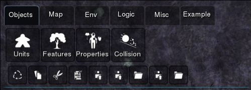
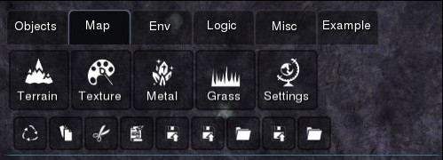
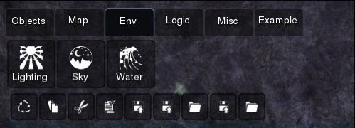
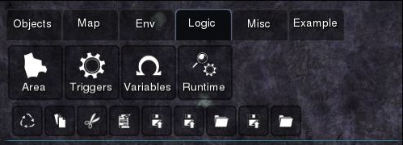
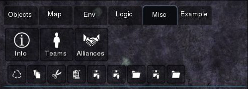
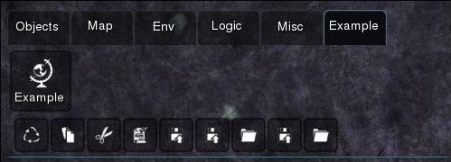

Starting out
============

This section introduces the layout of SpringBoard. First make sure you have properly :ref:`installed <installing>` SpringBoard. If you are using officially distributed packages, simply run the executable to start SpringBoard. In case you're using a game-specific version of SpringBoard, refer to its manual on how to run it.

.. note:: SpringBoard might show a black screen on the first run until it loads. This is expected behavior, during which the program is caching files, and the program isn't hanging.

.. note:: Avoid running it in Multiplayer mode (even if it's just a host bot), as SpringBoard might cause extensive network usage, and not work properly.

Layout
------

Once you start the SpringBoard you should see something similar to :ref:`fig_overview`.

.. _fig_overview:
.. figure:: img/overview.jpg
   :align: center

   Overview

The main editor elements are in the top right part of the UI, separated into tabs. Each of the large buttons with icons represents a specific Editor control.

At the bottom of the screen is the status display, which shows various information about the current state of the Editor, such as memory usage, mouse position, currently selected objects and the undo-redo stack.

At the top left is the project name, and just next to the tabs is the team changer control. In the top middle of the screen is the Start/Stop button which is used to start/stop testing the project.

Zooming in :ref:`fig_objects`, we look at the tab elements in more detail.

.. _fig_objects:

   Objects tab

The editor is split into 5 main categories (with an extra one for the example tab). It is possible to navigate between these tabs by either clicking on them or by pressing Shift+Tab to go forward and Shift+Control+Tab to go backwards. For additinoal hotkeys refer to :ref:`hot_keys`.

The smaller buttons are shared between all tabs and represent common actions actions such as *Reload meta model, Copy, Cut, Paste, Save project, Save project as, Load project, Export to, Import from* are accessible from all tabs. *Reload meta model* is unique to SpringBoard, and will be described in the :ref:`meta_programming` section.
Additional common buttons (*Undo, Redo, Clear undo-redo Stack*) are available in the bottom middle of the screen, in the status window.

The tab opened by default is the :ref:`fig_objects`. The first two buttons (*Units* and *Features*), are editors for adding and removing unit and feature objects in the game world, with the *Set* and *Brush* editing modes. The *Properties* editor allows editing properties of any selected object group, while *Collision* provides support for editing collision mechanics related properties.

.. _fig_maps:

   Map tab

The :ref:`fig_maps` offers components for editing various `Spring maps <https://springrts.com/wiki/Mapdev:Main>`_. `Heightmap <https://springrts.com/wiki/Mapdev:height>`_ can be edited with the *Terrain*, via the *Add*, *Set*, and *Smooth* tools. `Diffuse <https://springrts.com/wiki/Mapdev:diffuse>`_, `Specular <https://springrts.com/wiki/Mapdev:specular>`_ and `DNTS <https://springrts.com/wiki/Mapdev:splatdetailnormals>`_ maps can be edited using the *Texture* tools, which also support applying arbitrary filters like *blur* and *sharpen* as well as a *Void* editing tool which can be used to make certain map parts invisible.

The *Metal* and *Grass* elements provide support for editing the `metal <https://springrts.com/wiki/Mapdev:metal>`_ and `grass <https://springrts.com/wiki/Mapdev:grass>`_ maps respectively.
Games that instead use metal spots (or any point-based resource system) should refer to :ref:`extension_games`.

*Settings* allows configuring some map rendering properties, and it also includes an *experimental* map compilation tool (Linux only for now).

All map editing tools support custom :ref:`assets` (both brushes and materials).

.. _fig_env:

   Env tab

The :ref:`fig_env` (environment) can be used to set various rendering options. *Lighting*, *Sky* and *Water* can be used to set `lighting <https://springrts.com/wiki/Mapdev:mapinfo.lua#Lighting>`_, `atmosphere <https://springrts.com/wiki/Mapdev:mapinfo.lua#atmosphere>`_ and `water <https://springrts.com/wiki/Mapdev:mapinfo.lua#water>`_ options respectively.

.. _fig_logic:

   Logic tab

The :ref:`fig_logic` provides components to program the scenario, and can be used to add areas, triggers and variables. This is explained in detail in the :ref:`making_scenarios` section.

.. _fig_misc:

   Misc tab

The :ref:`fig_misc` allows editing of players and alliances, as well as setting general project information.

.. note:: Any changes to the Players component that leads to new teams being added or old ones removed requires a restart of the game.

.. _fig_example:

   Example tab

Lastly, the :ref:`fig_example` shows how a custom :ref:`extension <extensions>` can be seamlessly integrated into SpringBoard.
