.. _gui_programming:

GUI Programming
===============

Scenario programming consists of writing triggers - components that consist of events, conditions and actions.
Each trigger can have multiple events - *any* of which can invoke it. Once the trigger has been invoked, *every* condition will be checked, and only if *all* of them are true, *all* actions will be executed.

We are going to create an example trigger that demonstrates basic SpringBoard GUI programming elements, based on the Gravitas game.

To begin, we are first going to add a couple of Projector units to the map, using the *Objects/Units/Add* tool.

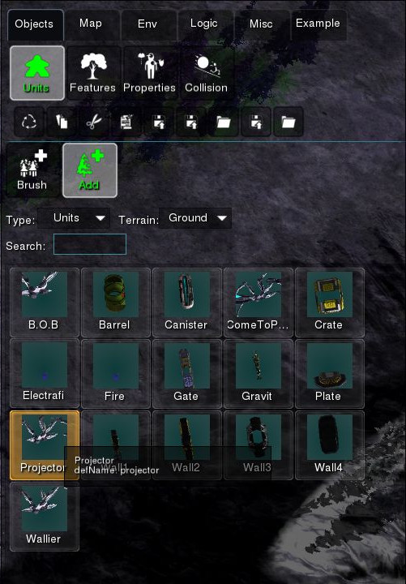

Add three units like below.

.. image:: img/guiprog/2.jpg
   :align: center

Then we're going to add an Area on the map, using the *Logic/Area/Add* tool.

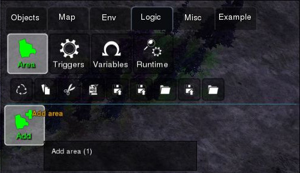

Add an area slightly below of units as demonstrated.

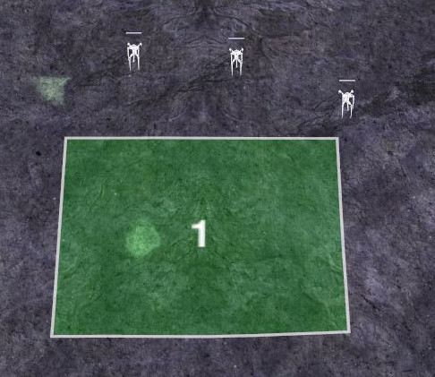

Now we're going to actually start GUI programming, by creating a new trigger trigger.

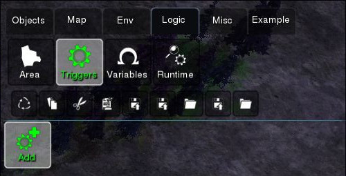

Pressing the *Add* button should open a new trigger window, which we can rename.

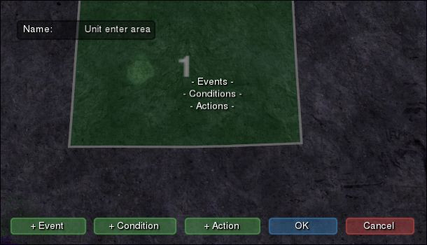

We are then going to add a new *event*: ``Unit enters area``. This *event* provides two parameters: ``unit`` and ``area``, which denote the objects that caused the event.

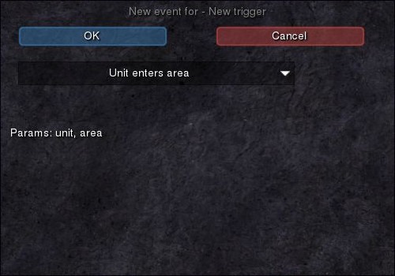

We are then going to confirm if the triggered area is our newly created area, by creating a ``Compare area`` *condition*.

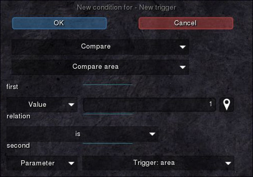

Lastly, we are going to create a ``Destroy unit`` action which will destroy the unit that has entered the area.

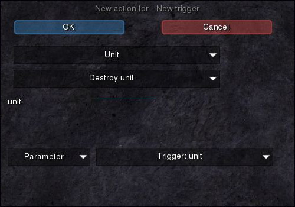

The resulting trigger should be similar to the picture below.

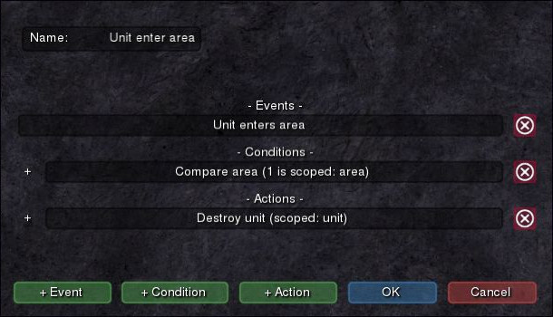

We can now test our trigger. Before starting the game, we should confirm that we have selected ``Team 1`` as our team, otherwise we won't be able to control the units.

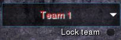

To start testing, we can now press the *Start* button. Moving the units into the area will destroy them as expected.

After we have stopped testing, let's now add two *B.O.B* units using the same *Objects/Units/Add* tool as before.

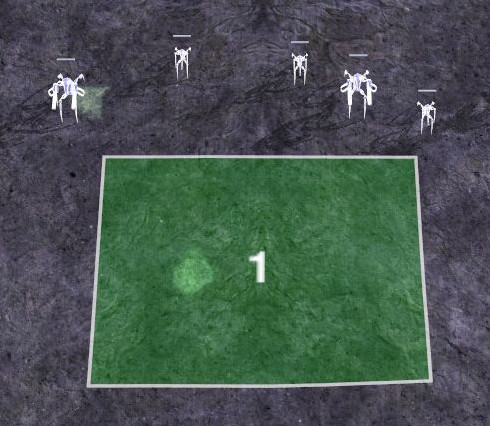

Now, let's say we don't want *B.O.B* units to be destroyed when they enter the area. We can add another condition that will check the unit type of the entered unit. To do this, we need to use an expression, that will return the unit type of the entered unit.

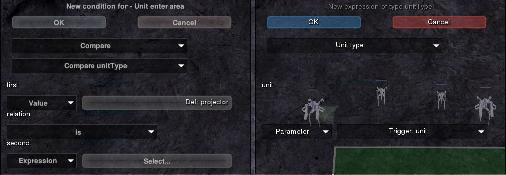

The resulting trigger is displayed below. If we were to test the scenario again, we will see that *B.O.B* units aren't being destroyed anymore, which is the desired effect.

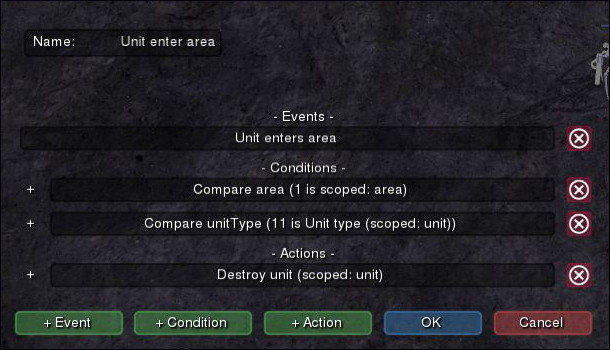

Lastly, let's only destroy one unit. To do this, we can count the number of units that have been destroyed, and only destroy the unit if we have destroyed less than ``1``. We are going to create a new *variable* ``units_killed`` which can be used for counting destroyed units.

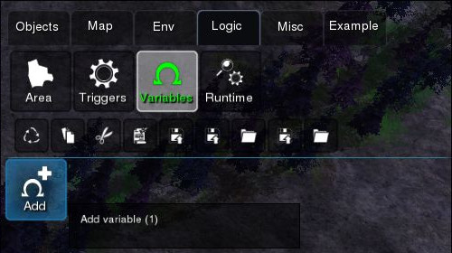

We're going to define it as a ``number`` variable type and set it to ``0``.

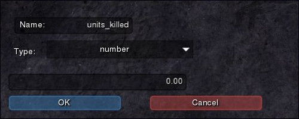

Back in our trigger, we're going to create a new condition which compares the ``units_killed`` variable with ``1``.

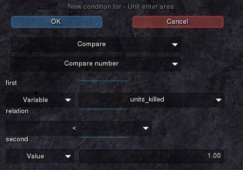

We also need to increment the variable as a new action. We do this by assigning a new value to the variable, that is the result of adding the old value to ``1``.

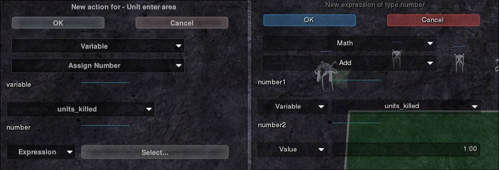

The resulting trigger is displayed below. Testing it, only the first unit will be destroyed, as desired.

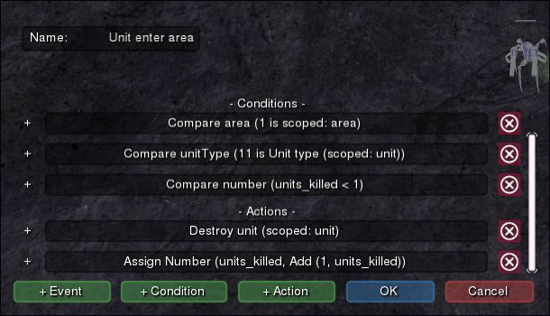
