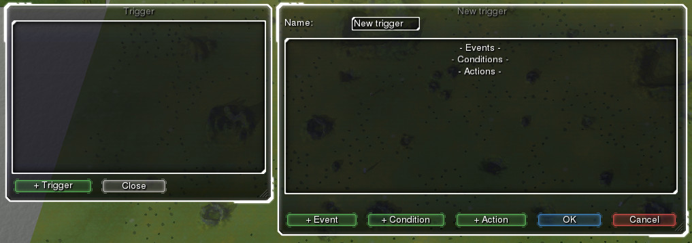
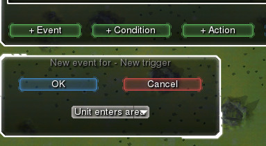
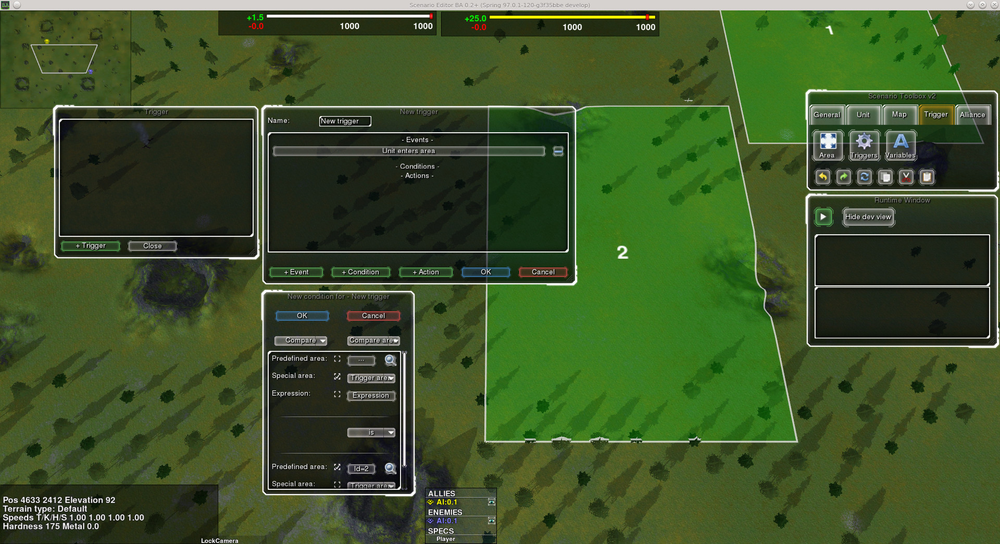

.. _gui_programming:

GUI Programming
===============

Scenario programming consists of writing triggers - components that consist of events, conditions and actions.
Each trigger can have multiple events - *any* of which can invoke it. Once the trigger has been invoked, *every* condition will be checked, and only if *all* of them are true, *all* actions will be executed.

Take an example trigger: "If the health points of the unit that entered area 2 is smaller than 50%, destroy that unit". This can be written as follows::
    
    Events: - Unit enters area
    Conditions: - Entered area == area2
                - hp%(trigger_unit) < 50
    Actions: - Destroy_unit(trigger_unit)

To do just that using the in-game editor, do the following:

1. Open the triggers window and add a new trigger.

2. Add a new event and chose "Unit enters area" from the combobox.

3. Add a new condition and choose Compare area. Select trigger area as first, and choose area2 by clicking on the "Predefined area" button and selecting it on the map.

4. Add another condition where you will compare numbers. Compare "50", using the relation ">", and select expression as the second number. In the new window, select Unit Health% of "Trigger Unit".

.. image:: unit_health_percent.jpg
   :scale: 70%
   :align: center

5. Lastly, add a new Destroy unit action.

.. image:: destroy_unit.jpg
   :scale: 70%
   :align: center

6. This is how your trigger should look. Confirm it by clicking on the OK button.

.. image:: final_trigger.jpg
   :align: center
