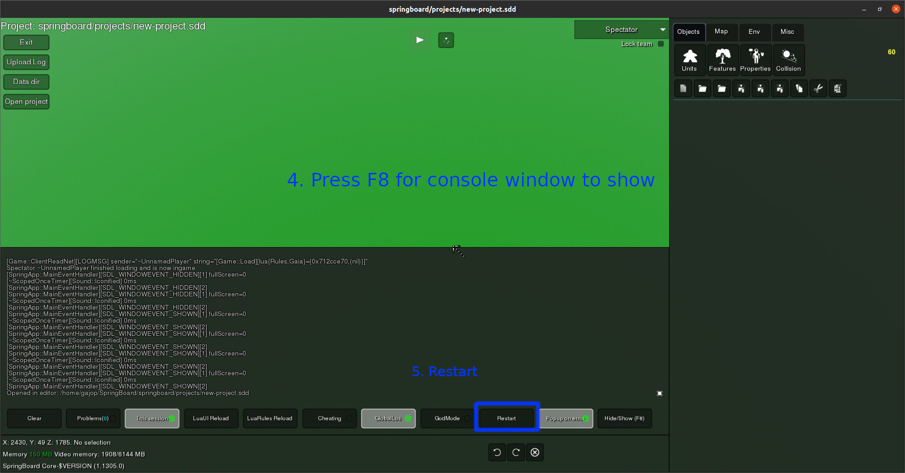
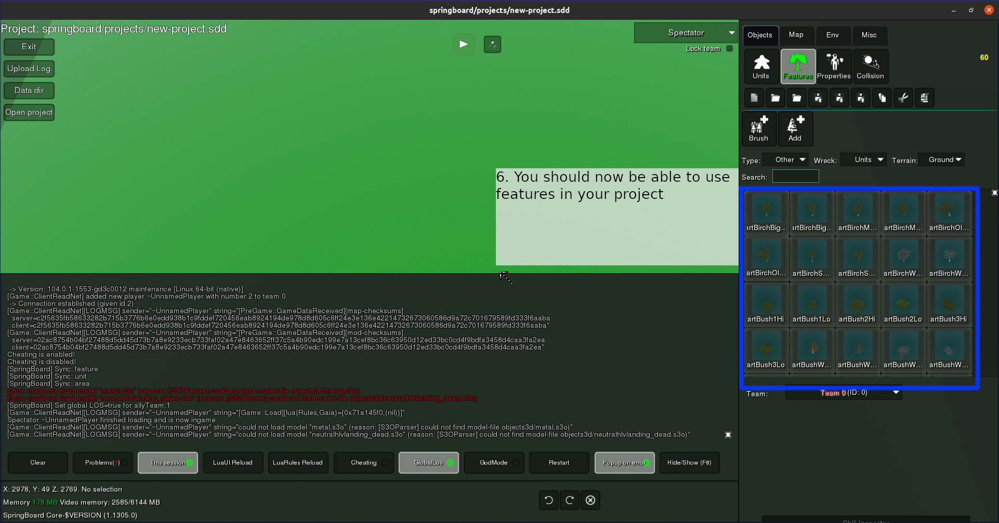

.. _map_features:

Map Features
============

Importing
---------

SpringBoard doesn't come with any map features besides the engine-default geovent, so if you want to add them you first need to import them into your project.

To import new features you need to perform the following steps:

1. Find existing feature sets (e.g. `SpringFeatures<https://github.com/Spring-Helper-Projects/spring-features>`_) or make your own following the official `Spring docs<https://springrts.com/wiki/Gamedev:FeatureDefs>`_.

2. Copy features into your project and restart.

Below is an example of how to copy ``SpringFeatures`` into a SpringBoard project.

.. image:: img/features/features1.jpg
   :align: center

:align: center

:align: center

Exporting as Spring archive (recommended)
-----------------------------------------

**Exporting your project using the "Spring archive" export option will include all features and is the recommended way to export a SpringBoard project.**

Export manually
---------------

Manual export is only recommended if you want to customize the export process (perhaps you want to compile the map yourself using a third-party tool).
In that case you can follow the below tutorial.

s11n export should be used if you want to export game objects (units, features, etc.) and load them in your standalone map.
Install s11n as you would normally:

1. Copy the `s11n <https://github.com/gajop/s11n>`_ and `LCS <https://github.com/gajop/Lua-Class-System>`_ folders to the ``libs/s11n`` and ``libs/LCS`` folders of the map (create destination directories as necessary).

2. Copy `s11n_gadget_load.lua <https://github.com/gajop/s11n/blob/master/s11n_gadget_load.lua>`_ from the ``s11n`` folder to ``LuaGaia/Gadgets/`` of the map folder.

Then setup s11n to load your exported objects:

1. Copy your exported s11n model file to map's ``mapconfig`` folder.

2. Copy `s11n_load_map_features.lua <https://github.com/gajop/s11n/blob/master/s11n_load_map_features.lua>`_ to map's ``LuaGaia/Gadgets/`` folder.

3. Set the `file path <https://github.com/gajop/s11n/blob/master/s11n_load_map_features.lua#L15>`_ to your s11n model file in the newly copied ``s11n_load_map_features.lua``

Including feature defs, compiling the map and setting mapinfo.lua is outside the scope of this guide. Please consult the Spring `MapDev <https://springrts.com/wiki/Mapdev:Main>`_ pages for that.