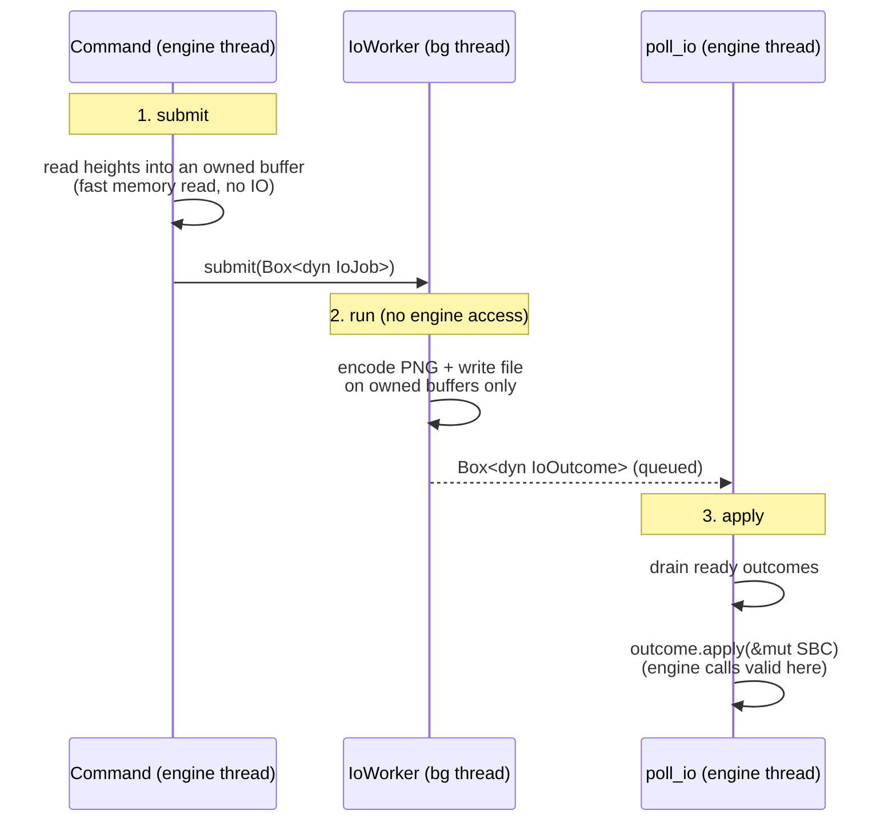

# Async IO

Some commands do **file IO** and **image decode/encode** — heightmap import /
export, texture export, map compile. That work must not run on the engine thread
(it would stall the frame), and the file/image work must not touch the engine
(it runs on another thread, where engine calls are invalid).

One rule keeps these apart:

> **The background thread never touches the engine. The engine thread never does file IO.**

## The worker

A single background worker thread, owned by an `IoWorker` created once at plugin
init and living for the whole plugin lifetime. Two channels connect it to the
engine thread: jobs go out, outcomes come back.

The worker is **feature-agnostic**. It moves a `Box<dyn IoJob>` to the thread and
a `Box<dyn IoOutcome>` back, knowing nothing about what either does. Each feature
slice defines its own job and outcome types in its own module, so adding one
never edits the worker.

Two trait bounds enforce the rule at compile time:

- `IoJob: Send` and owns its data — it has **no engine handle**, so the worker
  physically cannot reach the engine.
- `IoOutcome::apply(&mut SBC)` takes the engine handle, and only runs back on the
  engine thread, where engine calls are valid.

## The three phases

Take heightmap export as the worked example: read every height, encode a PNG,
write it to disk.

1. **Submit (engine thread, on command dispatch).** Read whatever engine data
   the job needs into an owned buffer — a fast memory read, not IO. Build an
   `IoJob` (owns only `Send` data, holds no engine handle) and `submit` it.
2. **Run (worker thread).** `IoJob::run` does the file read/write and image
   decode/encode on owned buffers only, returning a `Box<dyn IoOutcome>`. No
   engine access — the missing handle makes that a compile-time guarantee. A
   failed job still returns an outcome that applies as a logging no-op.
3. **Apply (engine thread, on drain).** `IoOutcome::apply(&mut SBC)` applies the
   effect (e.g. `set_height_map` for import) where engine calls are valid.

Import is the mirror image: the job reads + decodes a file, the outcome writes
the decoded heights into the engine.

## The drain point

`SBC::update` (the native `Update` callin — unsynced, once per render frame)
drains any ready outcomes and applies them. Unsynced rather than `game_frame`
because IO shouldn't be tied to the sim clock: `update` fires at a steady cadence
regardless of pause or game speed.

## Status

The worker shell, the `IoJob` / `IoOutcome` seam, the `poll_io` handler, and the
`widget:Update` driver all landed with slice 1 as common infrastructure, with no
job types wired. The first concrete job/outcome types land with the heightmap
slice (import / export); adding them does not touch the shell.

See also: [Command system](command-system.md) — async IO is kicked off by command
dispatch and applied on the same boundary the command system runs on.
