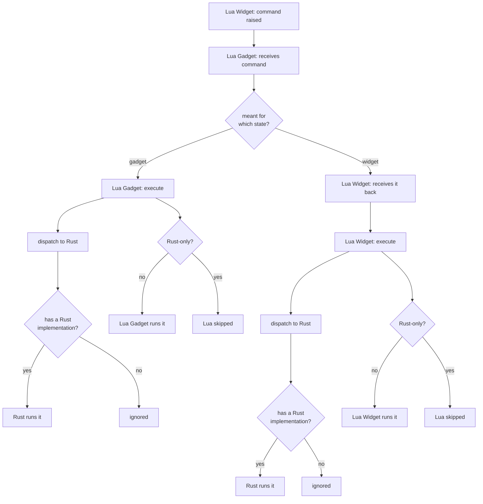
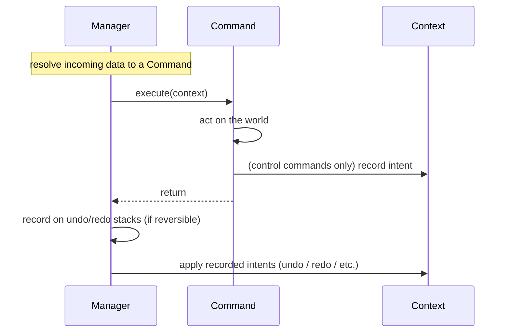

# Command system

A **command** is a serializable object with an `execute` and (if reversible) an
`unexecute`. The undo/redo stack replays them.

## The two Lua states

Editor logic runs in two states:

- **Lua Widget** -- unsynced, per-client: the UI.
- **Lua Gadget** -- synced, identical across clients: authoritative state.

Both run a command manager. A command is always raised in the widget and always
sent to the gadget. A gadget command executes there; a widget command is sent
back to the widget and executes there.

## Executing a command

Wherever a command executes, that state dispatches it to the Rust command system,
and may also run a Lua implementation. The Rust system runs a command if it has a
Rust implementation; the Lua implementation runs unless the command is marked
Rust-only. The two are independent: a command can run in Rust, in Lua, or in
both.

## Inside the Rust command system

When the Rust system runs a command:

### Resolving a command

A command arrives as data identifying its type. The manager looks up the handler
for that type, which reconstructs the command object. Handlers register
themselves, so adding a command is a self-contained addition rather than an edit
to a central list. A few known types are intentionally ignored on the synced
side and resolve to nothing.

### Executing and undo/redo

The manager runs the command, then settles the stacks:

- A reversible command goes onto the undo stack -- or, in multiple-command mode,
  into a group that collapses into one undoable unit when the mode ends.
- The undo stack is capped (oldest evicted). Any new command clears the redo
  stack.

### Commands and the manager: intents

A few commands operate on the manager itself (undo, redo, clear, toggle
multiple-command mode) rather than on the world. Such a command can't call the
manager while the manager is mid-execute running it. Instead it records an
**intent**, which the manager applies once the command returns. This expresses
the reentrant manager-calls-command-calls-manager relationship without shared-mutability
wrappers, and keeps ownership flat. Ordinary commands record no intent.
