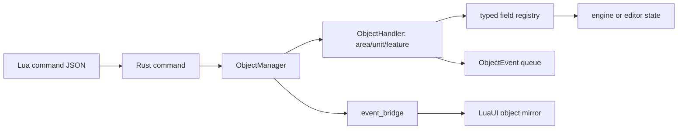

# Object Commands

Objects are addressed by **model id**, not Spring id. The model id is stable
across undo/redo and save/load. Units/features also have a Spring id; areas do
not, so their model id is the object id. `ObjectManager` owns the per-kind
handlers and asks each handler to translate model id to Spring id when needed.

`AddObjectCommand` parses wire params through `objects::codec` into typed
`ObjectData`, creates the object, applies its fields, and records an added
event. `RemoveObjectCommand` reads the object before destruction so undo can
re-add the same model id. `SetObjectParamCommand` captures old typed field
values on first execute, parses new typed values, then applies one field or a
field set.

Fields are registered next to each kind's s11n with `inventory::submit!`.
Each field implements `TypedField<Model>` and declares its Rust `Value`,
descriptor, getter, and setter together. Runtime dispatch erases values only to
share one registry; field implementations themselves get typed values, not JSON.

The current wire format is still JSON. `codec.rs` is the boundary that converts
JSON to typed `FieldValue` and back for command input, save-shaped reads, tests,
and LuaUI notifications. Model code should not serialize just to apply fields.

Set-many intentionally iterates over the supplied typed fields. Unit/feature
handlers also preserve the old Lua ordering quirks around rotation and movement,
because engine position updates can disturb facing. That behavior belongs in the
kind handler, not the UI.

Models emit `ObjectEvent::{Added,Removed,Updated}` only. They do not know about
Lua. `ObjectManager` drains events after add/remove/set; `event_bridge` turns
those events into widget commands so LuaUI's object mirror stays current. Later
Rust UI/state consumers can subscribe at the same event boundary without changing
the models.

Known pressure points: generic object commands still carry JSON at the command
boundary; descriptors are collected into `Vec`s from inventory on lookup; field
application is name-based after parsing; notifications currently still bridge to
LuaUI because the frontend mirror is Lua-owned during the port.
