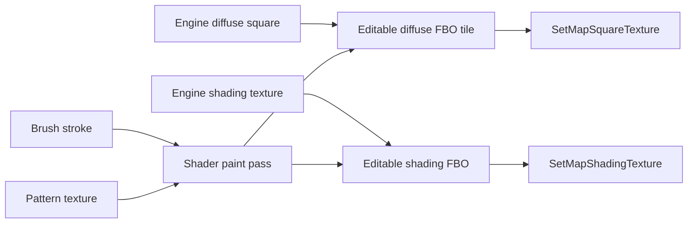
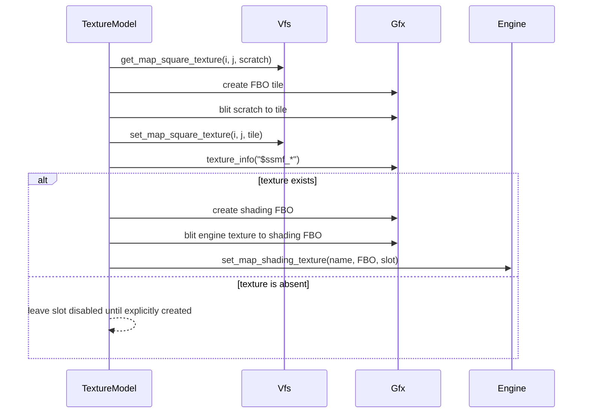
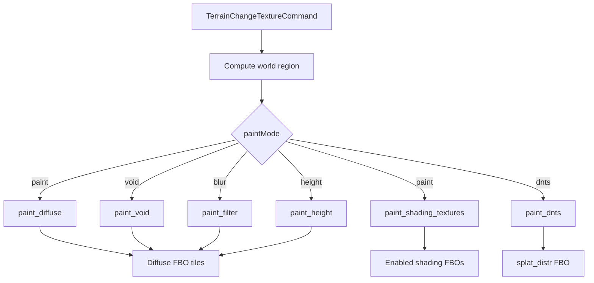
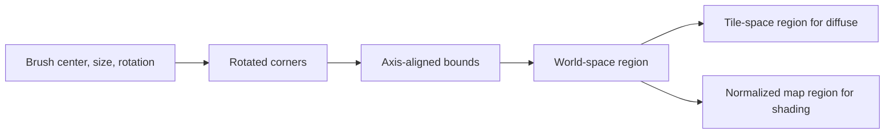
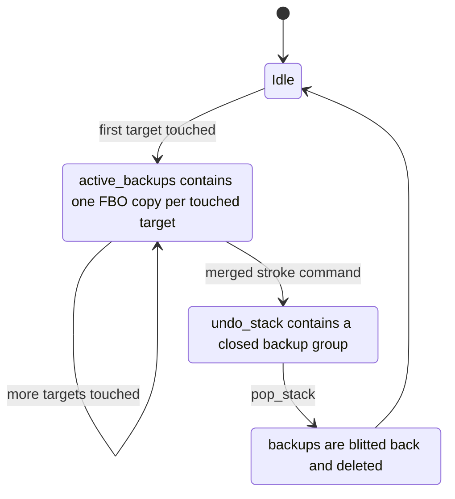
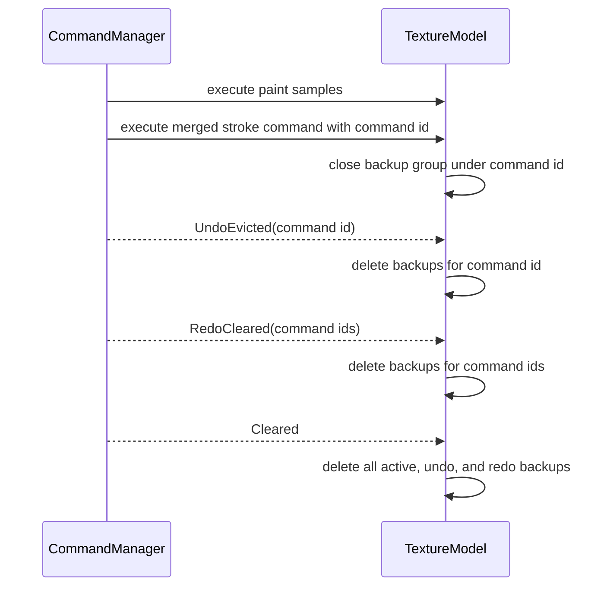
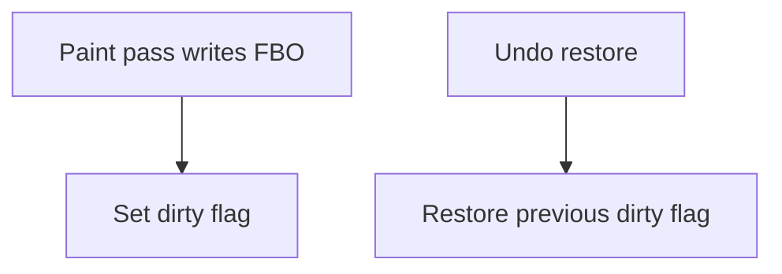
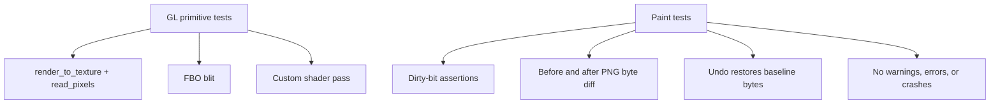

# Texture paint

Texture painting edits the visual material of the map. A brush stroke can write
to the diffuse ground texture, one or more shading textures, or the DNTS splat
distribution texture. All writes happen through editable FBO textures that the
engine is then told to render from.

## Concepts

The engine owns the original map textures. The editor owns editable mirrors.
Paint operations render into those mirrors, not directly into the engine-owned
textures.

The texture manager keeps three groups of state:

- Diffuse tiles: 1024 by 1024 FBO textures covering the map.
- Shading textures: optional editable FBOs for `$ssmf_specular`,
  `$ssmf_emission`, `$ssmf_sky_refl`, `$ssmf_splat_distr`,
  `$ssmf_splat_normals:0..3`, and `$detail`.
- Undo copies: temporary FBO backups of textures touched by the current stroke.

## Initialization

When texture painting is first used, the manager creates editable copies and
binds them back to the engine.

Some shading textures are optional. A map may not ship all of them. When the
editor enables a missing shading texture, that texture is created and bound
through the engine first. Before painting an enabled channel, the texture
manager checks whether it already has an editable mirror. Existing map textures
are mirrored by engine lookup name. Newly created optional textures are mirrored
from the texture handle carried by the paint command.

## Paint Flow

`TerrainChangeTextureCommand` is the command entry point. It normalizes the
brush parameters, computes the affected region, and dispatches to the paint mode
implementation.

Every pass follows the same rendering pattern:

1. Compile or fetch the shader from `ShaderCache`.
2. Bind pattern, brush, heightmap, or previous texture inputs.
3. Open undo backups for the target textures.
4. Render a quad into each target FBO with `Gfx::render_to_texture`.
5. Mark touched targets dirty.

## Paint Modes

| Mode | Target | Shader | Purpose |
|------|--------|--------|---------|
| `paint` | Diffuse tiles and enabled shading textures | `map_drawing.glsl` | Apply brush and pattern with the selected blend mode. |
| `void` | Diffuse tiles | `void_drawing.glsl` | Reduce alpha in the diffuse texture. |
| `blur` | Diffuse tiles | `map_blur_drawing.glsl` | Apply a filter kernel such as blur, outline, or Sobel. |
| `height` | Diffuse tiles | `map_height_drawing.glsl` | Paint using heightmap-weighted color. |
| `dnts` | `$ssmf_splat_distr` | `dnts_drawing.glsl` | Write the selected DNTS material slot. |

Shader programs are cached by shader path and blend mode. Sampler uniforms use
fixed texture units so all passes can share the same binding conventions.

## Region Math

The brush is a square in world space. Rotation can make its bounding box larger
than the original square, so the command computes an axis-aligned world-space
region before deciding which targets are touched.

Diffuse passes divide by `TEXTURE_SIZE` to find affected FBO tiles. Shading
passes use normalized whole-map coordinates because each shading texture covers
the map as one texture.

## Undo

Texture painting uses copy-on-write undo. The first time a stroke touches a
texture, the manager copies the current texture into a backup FBO. Later writes
in the same stroke reuse that backup.

Tile backups and shading backups live in the same undo group. A stroke that
touches both diffuse and shading textures therefore reverts atomically.

Closed texture undo groups are keyed by command id. The command manager emits
history events when ids leave undo/redo history, and the texture manager drops
matching GPU backups.

## Dirty State

Dirty flags record which editable textures have changed. Tests use them for
paint/undo assertions, and save/export code can use them to decide which
textures need to be written.

Undo restores both pixels and the previous dirty flag. That keeps the texture
manager's state consistent even before project save/export uses these flags.

## Runtime Requirements

Texture painting must run where GL and unsynced rendering APIs are valid.
`Gfx::render_to_texture` binds the target FBO for the duration of its callback,
so all draw calls and readbacks for that target must happen inside the callback.

The same rule applies to tests that call `read_pixels` or `save_image`: bind the
FBO with `render_to_texture`, then read or save while it is still bound.

## Tests

The texture tests cover both GL primitives and paint behavior.

PNG byte comparison is used as a practical visual assertion. With deterministic
image output, matching bytes mean matching pixels, and differing bytes prove the
paint pass changed the target texture.

## Related Files

The textures feature lives under `native/src/sbc/textures/{commands,model,tests}`.

- `textures/model/texture_model/` — `TextureModel` (a container of components) +
  `tiles.rs`, `shading.rs`, `cache.rs`, `history.rs` (active stroke + undo/redo),
  `surface.rs`
- `textures/model/draw/` — the per-mode paint passes
- `textures/model/shader_cache.rs`, `textures/model/texture_drawing.rs`,
  `textures/model/graphics.rs`
- `textures/commands/` — `TerrainChangeTextureCommand`, its merged command,
  `CacheTextureCommand`
- `textures/tests/` — in-engine tests, each registered via `crate::integration_test!`
- `tools/smoke/test_integration.py` — boots once and runs every registered test
  (filter a slice with `SBC_TEST_TAGS=textures`)
