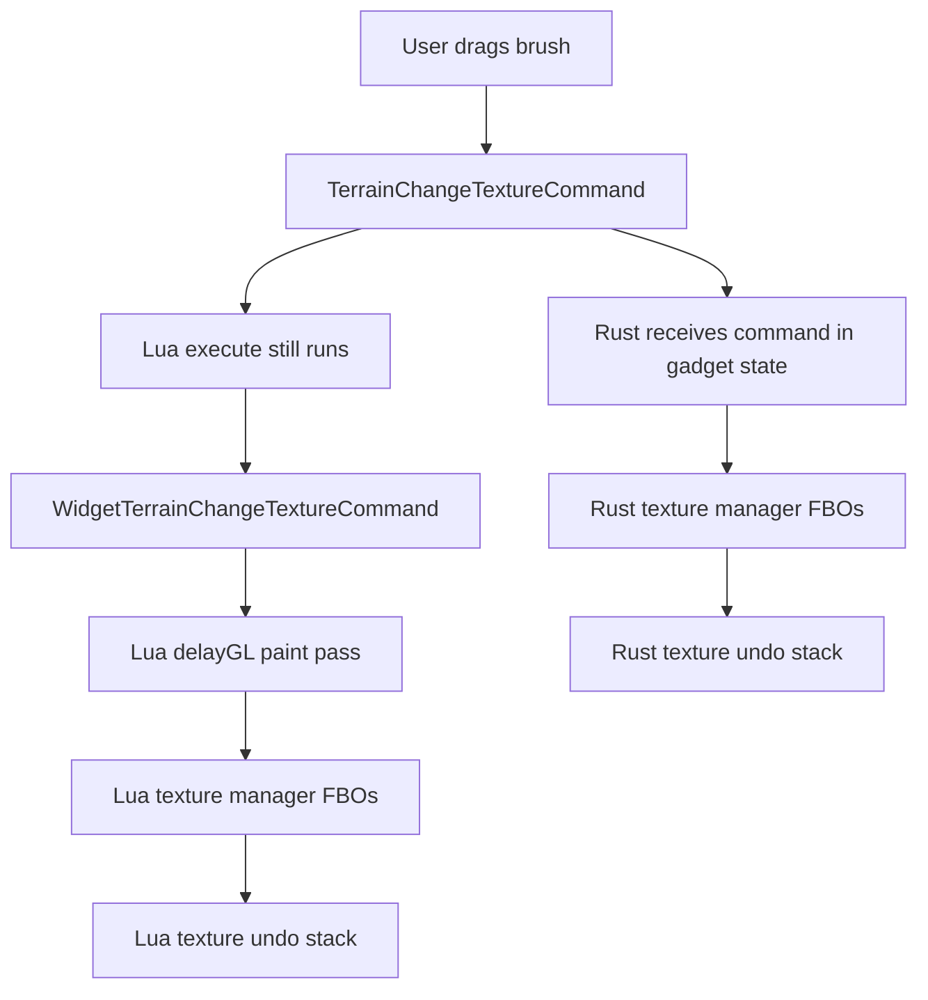
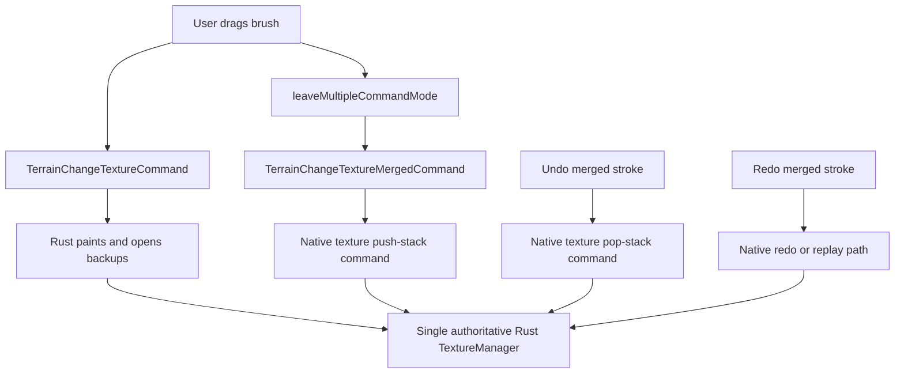

# Texture Paint Ownership Gap

This document is a handoff for finishing texture painting in wip before any
slice-4 copy to stable. The current wip implementation contains a native paint
pipeline, but it does not make Rust own the editor workflow end to end. As a
result it violates the slice rule: each slice must be a working user-visible
piece, not a native subsystem that runs beside the old Lua owner.

## Current State

Rust currently implements the paint rendering primitives:

- `native/src/sbc/commands/textures/texture_manager.rs`
- `native/src/sbc/commands/textures/draw.rs`
- `native/src/sbc/commands/textures/shader_cache.rs`
- `native/src/sbc/commands/textures/texture_drawing.rs`
- `native/src/sbc/commands/textures/terrain_change_texture_command.rs`
- `native/src/sbc/commands/textures/cache_texture_command.rs`

The editor workflow is still Lua-owned:

- `TerrainChangeTextureCommand` is not in `nativeCommandsOnly`.
- `CacheTextureCommand` is not in `nativeCommandsOnly`.
- `WidgetTerrainChangeTextureCommand` still performs widget-side `delayGL`
  painting through Lua.
- `WidgetTerrainChangeTexturePushStackCommand` still closes the texture undo
  group in Lua.
- `WidgetUndoTerrainChangeTextureCommand` still pops the Lua texture stack.
- Rust's `TextureManager` has its own FBOs and undo stack, separate from
  `SB.model.textureManager`.

The current Rust source even documents this split:

```rust
// command opens a backup group, WidgetTerrainChangeTexturePushStackCommand
// (Lua) closes it, WidgetUndoTerrainChangeTextureCommand (Lua) pops it.
```

That split is the bug.

## Why This Is Not a Valid Slice

Texture painting is not just "run a shader." A usable slice must own:

- The paint pass.
- The FBOs that the engine renders from.
- Stroke grouping.
- Closing the stroke into an undo entry.
- Undo and redo.
- Cache texture state used by brush and pattern sampling.

Right now Rust proves it can do some of those jobs in integration tests, while
Lua still handles the real editor workflow.



There are two independent texture managers and two independent undo stacks.
That is not ownership. It is parallel execution with unclear authority.

## Bridge Constraint

The command bridge currently invokes native only from the gadget-side same-state
path:

```lua
if not self.__isWidget then
    Spring.InvokeNativeModule(json.encode(msg:serialize()))
end
```

Widget commands do not automatically invoke native. Therefore this is not a
valid fix:

```lua
nativeCommandsOnly = {
    WidgetTerrainChangeTexturePushStackCommand = true,
    WidgetUndoTerrainChangeTextureCommand = true,
}
```

Adding those entries would suppress Lua widget execution without necessarily
calling Rust. That can break stroke close and undo outright.

## Required Cutover Shape

Finish the cutover in wip before copying to stable.

Recommended direction:



The exact command names are flexible, but the ownership rule is not:

- Rust must paint.
- Rust must close the stroke.
- Rust must undo the stroke.
- Rust must redo the stroke or replay the closed command consistently.
- Lua must not also paint the same stroke.

## Implementation Checklist

1. Add native commands for texture stack close and restore.

   Candidate commands:

   - `TerrainTexturePushStackCommand`
   - `TerrainTexturePopStackCommand`

   They should call:

   - `ctx.texture_manager.push_stack()`
   - `ctx.texture_manager.pop_stack()`

2. Change the Lua merge command path so stroke close uses a synced/native route.

   Current:

   - `TerrainChangeTextureMergedCommand:onMerge()` executes
     `WidgetTerrainChangeTexturePushStackCommand`.

   Desired:

   - It should execute a command that reaches Rust from the gadget path.

3. Change merged-stroke undo so it reaches Rust.

   Current:

   - `TerrainChangeTextureMergedCommand:unexecute()` executes
     `WidgetUndoTerrainChangeTextureCommand`.

   Desired:

   - It should execute a command that reaches Rust from the gadget path.

4. Decide redo semantics.

   Current Lua redo calls `TerrainChangeTextureMergedCommand:execute()`, which
   replays subcommands and then calls `onMerge()`. If the subcommands become
   Rust-only, verify that replay plus push-stack produces the same result and
   one undo group.

5. Flip only the commands that are fully owned.

   Likely candidates after the above:

   - `TerrainChangeTextureCommand`
   - `CacheTextureCommand`
   - the new synced texture push/pop commands

   Do not mark widget commands native-only unless the bridge explicitly invokes
   native for them.

6. Ensure Lua no longer writes the same texture stroke.

   `TerrainChangeTextureCommand:execute()` currently forwards to
   `WidgetTerrainChangeTextureCommand`. Once `TerrainChangeTextureCommand` is
   Rust-owned, Lua execution will be suppressed, so the widget paint pass should
   no longer run for that command.

7. Audit shading texture creation.

   Lua can create missing optional shading textures through
   `MakeAndEnableMapShadingTexture`. Rust currently mostly mirrors textures
   that already exist. If Rust owns painting, it must also support creation for
   editor-enabled optional textures such as `specular` and `splat_distr`.

## Required Tests

Automated tests must prove the cutover, not just the GL primitives.

Minimum test coverage:

- `TerrainChangeTextureCommand` paints each mode through Rust-only execution.
- A continuous stroke closes into exactly one Rust undo group.
- Undo restores diffuse tile pixels.
- Redo reapplies diffuse tile pixels.
- DNTS paint changes `splat_distr`.
- DNTS undo restores `splat_distr`.
- Specular shading paint changes `specular`.
- Specular undo restores `specular`.
- `CacheTextureCommand` is Rust-owned and still resolves cached textures.
- The texture-test boot has zero warnings, errors, and crashes.

Manual editor check:

- Paint with `paint`, `void`, `blur`, `height`, and `dnts`.
- End a dragged stroke and undo once. The whole stroke must revert.
- Redo once. The whole stroke must reappear.
- Enable a missing shading texture in terrain settings, paint it, undo and redo.
- Confirm the infolog is clean.

## Stable Copy Rule

Do not copy slice 4 to stable until wip has one authoritative texture owner.

Acceptable stable copy:

- Rust owns paint execution.
- Rust owns texture cache.
- Rust owns stroke close.
- Rust owns undo and redo for texture strokes.
- Lua does not also execute the paint writer for Rust-owned texture commands.
- Automated and manual checks above pass.

Unacceptable stable copy:

- Rust paint pipeline exists but live editor paint remains Lua-owned.
- Rust and Lua both keep separate FBO managers for the same stroke.
- Rust tests call manager methods directly while real editor undo uses Lua.
- Widget push/pop commands are suppressed without a native route.

## Resolution (wip)

The cutover is implemented. Rust now owns the editor texture workflow end to
end; the Lua paint/undo path is dormant (kept, not deleted).

What changed:

- **Single owner.** `TerrainChangeTextureCommand` and `CacheTextureCommand` are
  in `nativeCommandsOnly`, so the Lua widget paint pass no longer runs.
  `TerrainChangeTextureCommand` lazily calls `generate_map_textures()` on first
  paint, so Rust binds the editable atlas + shading copies to the engine (in
  production nothing else triggered generation before).
- **Stroke close is synced.** `TerrainChangeTextureMergedCommand:onMerge` now
  issues a synced `TerrainTexturePushStackCommand` (reaches the gadget →
  `InvokeNativeModule`), which calls `texture_manager.push_stack()` and is the
  single undoable history entry for the stroke.
- **Undo/redo route to Rust.** `TerrainChangeTextureMergedCommand` is
  `nativeCommandsOnly`, so the Lua command manager routes its undo/redo to the
  native `UndoCommand`/`RedoCommand`, which pop/replay the native texture stack.
  The manager grew a `redo_stack`: `pop_stack` captures the displaced (painted)
  state for redo, and `redo_stroke` replays it — a reversible swap owned entirely
  by Rust (no Lua replay of subcommands).
- **Shading-tex creation.** `make_and_enable_shading_texture` +
  `MakeShadingTextureCommand` let Rust create/bind an editor-enabled optional
  shading texture (e.g. `specular`); the terrain-settings dialog issues it after
  the Lua bookkeeping so Rust binds last and owns the painted copy.
- **History stays in step.** `ClearUndoRedoCommand` also clears the texture
  manager's undo/redo/active backups (freeing GPU textures).

Tests, two layers:

- **Native (in-engine, real GL)** — `texture_command_stroke_undo_redo` drives a
  full stroke through the command system (multi-command mode → paints →
  push-stack → Undo → Redo) and asserts one undo group + pixel-exact
  undo/restore + redo-reapply; `make_shading_texture_command` proves runtime
  creation. The whole texture-test boot stays warning/error/crash free. These
  prove Rust acts correctly on the commands it receives.
- **Lua bridge (standalone, no engine)** — `tools/lua_tests/command_bridge_test.lua`
  loads the real `command_manager.lua` + command classes under a mocked
  `Spring.InvokeNativeModule` and drives a gadget-side stroke. It asserts the
  exact native call sequence (`SetMultipleCommandMode` → 2× paint →
  `SetMultipleCommandMode` → `TerrainTexturePushStackCommand` → `UndoCommand` →
  `RedoCommand`) and that the Lua widget paint pass is suppressed (no
  `WidgetTerrainChangeTextureCommand` forwarded). This proves the *other* side of
  the contract — the bridge produces the right native calls and doesn't
  double-paint. Run via the Luacheck CI workflow.

Between the two, the Lua→Rust command path is covered end to end except for the
GUI event layer (mouse → editor state), which still needs the manual editor
check above. The synced-route GL assumption is still only exercised by the live
editor / native boot, not the standalone bridge test.
